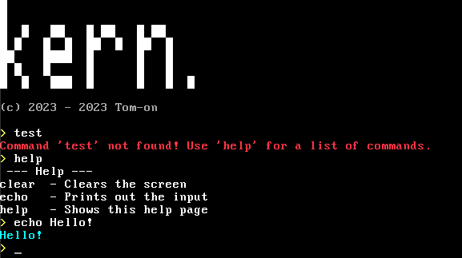
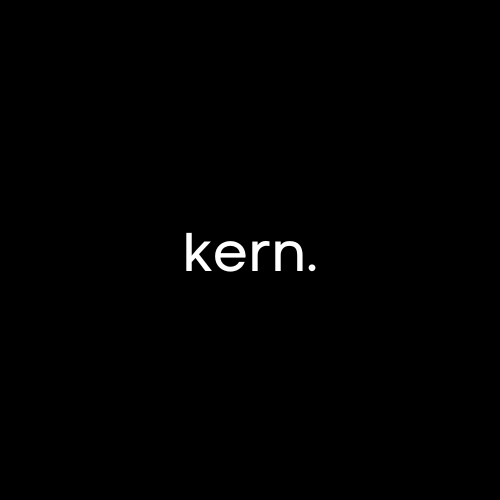

# kern. 

---

> [!IMPORTANT]
> This is an old version of kern. The new active repo is [Here](https://www.github.com/Tom-on64/kern)

Kern is a 32-bit x86 based OS written in Assembly and C. 
It has a Command Line Interface with a custom shell (Work in progress).
I also plan on adding a custom filesystem.

Example image: \

    </img>

Idk why i called it that it was 3am and i needed sleep
